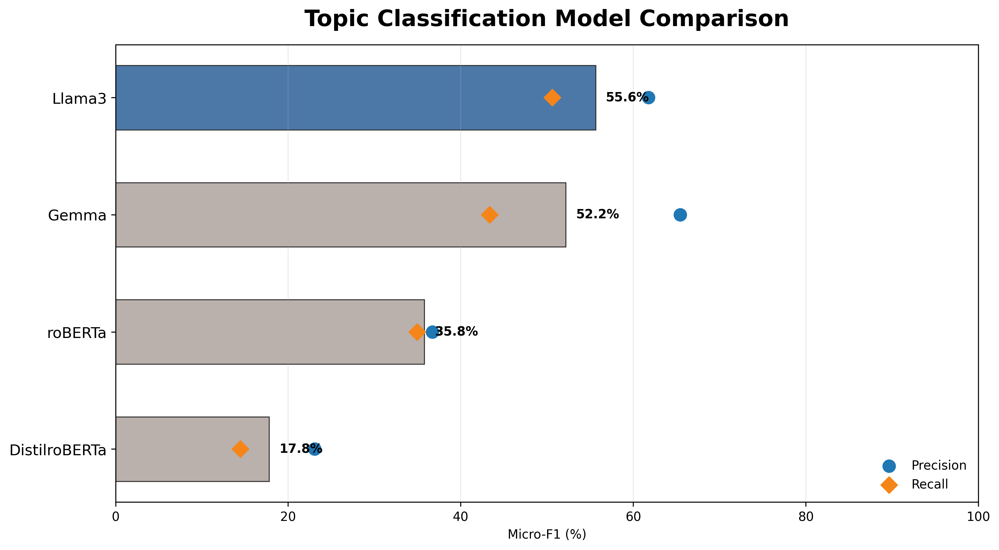
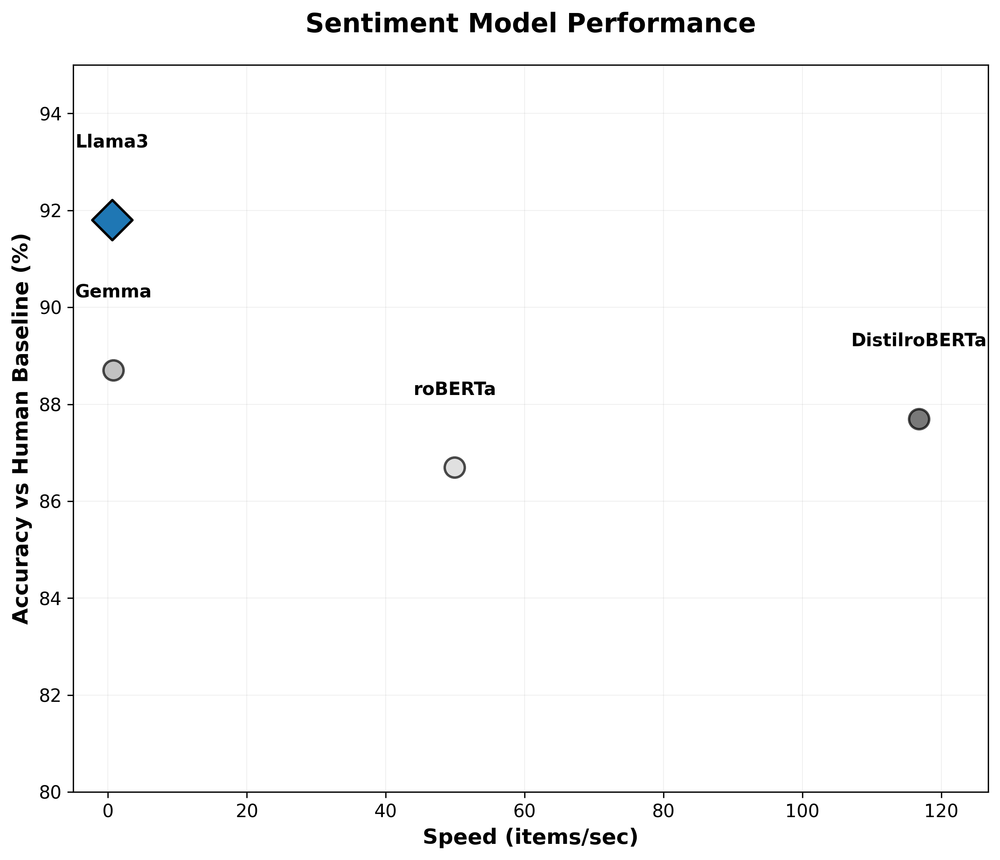
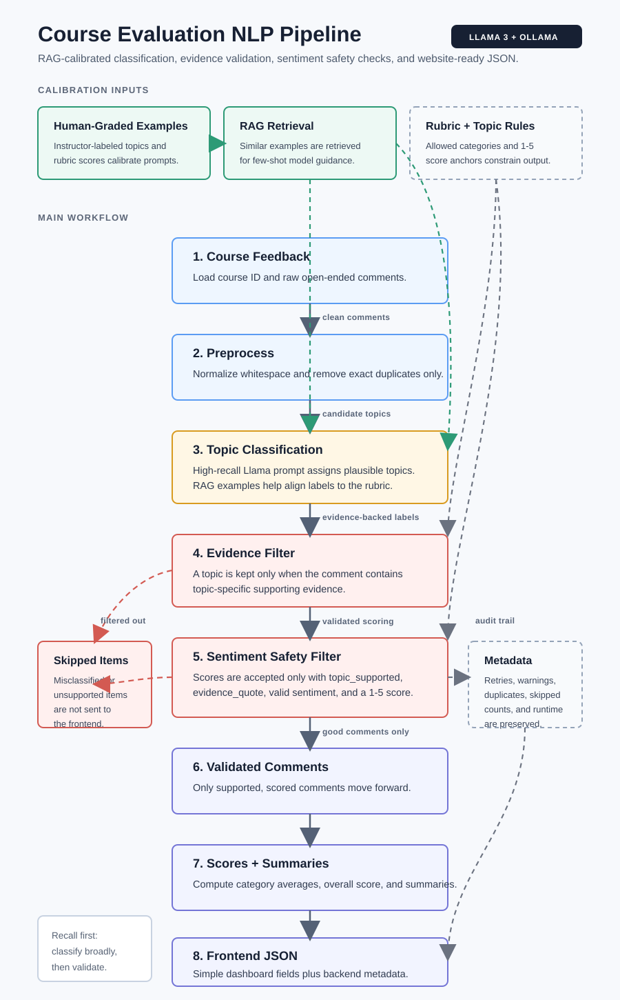
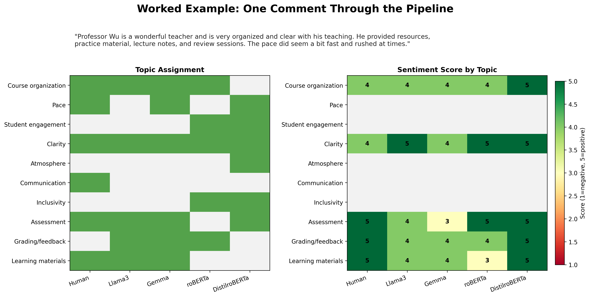

# NLP Course Evaluation Analysis

This repository analyzes open-ended course-evaluation comments with NLP models. It includes experiment scripts for comparing topic-classification and sentiment models, plus `main.py`, an end-to-end Llama3 pipeline for producing combined topic, sentiment, score, and summary reports.

## Poster and Visuals

Primary poster/report artifacts:

- [Capstone poster PDF](<Capstone Poster Template - Project & Research.pdf>)
- [Previous research results PDF](previous_research_results.pdf)
- [Experiment reproduction guide](experiments.md)

Model comparison posters:





Pipeline and analysis visuals:





## Main Pipeline Documentation

This document explains the combined course-evaluation pipeline in `main.py`, the libraries it imports, and the conventions to follow when contributing.

## Purpose

`main.py` runs the end-to-end Llama3 workflow:

1. Load raw course-evaluation comments.
2. Remove exact duplicate comments.
3. Retrieve similar human-labeled examples from the baseline CSV files as calibration only.
4. Classify each comment into one or more instructional topics.
5. Score sentiment for each supported topic using the topic-specific rubric.
6. Filter weak or unsupported topic assignments.
7. Summarize each topic.
8. Write combined JSON and CSV reports.

The main callable entry point is:

```python
analysis_pipeline(course_id, raw_comments)
```

Running `python3 main.py` uses the embedded `json_input` example near the bottom of the file.

## Imported Libraries

Standard-library imports:

- `csv`: reads human baseline CSV files and writes combined CSV output.
- `json`: parses model JSON responses and writes report files.
- `re`: normalizes text, extracts JSON, and checks evidence patterns.
- `time`: measures runtime and handles retry delays.
- `unicodedata`: normalizes comments for stable matching.
- `difflib.SequenceMatcher`: scores approximate comment similarity for retrieval.
- `pathlib.Path`: builds repository-relative input and output paths.
- `typing.Any`: annotates flexible parsed JSON and row data.

Third-party imports:

- `requests`: sends HTTP requests to the local Ollama API at `http://localhost:11434/api/generate`.

Local imports from `data.py`:

- `TOPIC_DEFS`: topic names and definitions used in prompts.
- `TOPIC_KEYS`: ordered list of scored topics.
- `SCORING_RUBRIC`: topic-specific 1-5 scoring rubric.

## Required Local Services and Files

Ollama must be installed and serving `llama3` before the pipeline runs:

```bash
ollama pull llama3
ollama serve
```

The RAG-style examples come from:

- `HUMAN_CATEGORIZED_OUTPUT.csv`
- `HUMAN_SENTIMENT_BASELINE.csv`

If those files are missing, the pipeline still runs, but it loses the calibrated example retrieval.

## Key Configuration

Important constants are defined near the top of `main.py`:

- `MODEL`: Ollama model name. Currently `llama3`.
- `RAG_CLASSIFICATION_EXAMPLE_COUNT`: number of retrieved human topic examples per classification prompt.
- `RAG_SENTIMENT_EXAMPLE_COUNT`: number of retrieved sentiment examples per scoring prompt.
- `OLLAMA_MAX_RETRIES`: HTTP retry count for Ollama requests.
- `MODEL_TASK_MAX_RETRIES`: retry count for classification and scoring parse failures.
- `CONFIDENCE_THRESHOLDS`: topic-specific thresholds for filtering likely mismatches.
- `TOPIC_EVIDENCE_PATTERNS`: regex evidence checks used to keep topic assignments grounded in the comment text.

When changing behavior, update these constants first before changing prompt text or output format.

## Pipeline Flow

### Text Cleanup and Retrieval

`normalize_comment`, `canonical_comment_key`, `retrieval_tokens`, and `retrieval_similarity` prepare comments for duplicate removal and example retrieval.

`load_classification_examples` and `load_sentiment_examples` read the human baseline CSVs. `retrieve_similar_examples` finds similar baseline rows and passes them into prompts as calibration examples. Exact comment matches are skipped during retrieval so the baseline is not used as an answer key.

### Classification

`classify_with_llama` sends each comment to Ollama and asks for all supported topics. It expects JSON with:

```json
{
  "topics": ["Topic Name"],
  "evidence": {
    "Topic Name": "phrase from feedback"
  }
}
```

After parsing, `filter_topics_by_evidence` removes unsupported topics and sends generic-only comments to `None of the above / Other`.

### Sentiment Scoring

`sentiment_with_llama` scores one comment-topic pair at a time. It expects JSON with:

```json
{
  "topic_supported": true,
  "sentiment": "positive",
  "score": 5,
  "confidence": 0.8,
  "evidence_quote": "short quote",
  "reasoning": "brief explanation"
}
```

Scores are integers from 1 to 5 and are converted into sentiment labels with `sentiment_from_score`.

### Validation and Reporting

The pipeline filters unsupported or mismatched topic assignments, computes topic averages, summarizes each topic, and returns a compact dashboard-friendly dictionary with:

- `course_id`
- `model`
- `overall_score`
- `category_scores`
- `topic_summaries`
- `categories`
- `metadata`

Each category comment in the public JSON keeps only:

- `feedback`
- `sentiment`
- `score`
- `confidence`
- `reasoning`

The internal model evidence fields are used for validation, but they are not included in the final JSON.

`metadata` includes only the processed comment count, original input count, duplicate count, dedupe mode, scored topic-comment count, and runtime.

When `write_files=True`, reports are saved to:

- `results/combined/<COURSE_ID>_COMBINED_REPORT.json`
- `results/combined/<COURSE_ID>_COMBINED_REPORT.csv`

The script entry point also writes:

- `results/<COURSE_ID>.json`

## How to Run

From the repository root:

```bash
source .venv/bin/activate
python3 main.py
```

To use the pipeline from another file:

```python
from main import analysis_pipeline

output = analysis_pipeline(
    course_id="MY_COURSE",
    raw_comments=[
        "The lectures were clear and organized.",
        "The exams felt rushed.",
    ],
)
```

Useful options:

- `output_dir`: custom output directory.
- `write_files=False`: return output without writing reports.
- `dedupe_exact_comments=False`: keep exact duplicate comments.
- `use_rag=False`: run without human baseline examples.
- `evidence_filter_mode="strict"`: require regex evidence for every assigned topic.

## Contribution Guidelines

Keep topic names centralized in `data.py`. If you add, remove, or rename a topic, update `TOPIC_DEFS`, `SCORING_RUBRIC`, baseline CSV columns, and any evidence patterns in `main.py`.

Preserve the output schema unless downstream comparison or visualization code is updated at the same time. Existing CSV consumers expect the current column names from `write_combined_csv`.

Keep prompts explicit about returning valid JSON. If you change prompt wording, test at least a few comments that cover generic praise, multi-topic feedback, negative feedback, and comments with weak topic evidence.

Use small, focused changes to the evidence patterns. Broad regexes can inflate false positives across multiple topics.

Do not commit private or sensitive raw course evaluations. Use anonymized examples or the existing sample comments in `data.py`.

Before handing off a change, run:

```bash
python3 -m py_compile main.py data.py
```

For behavior changes, also run a small pipeline sample with `write_files=False` or rerun `python3 main.py` with Ollama active.
